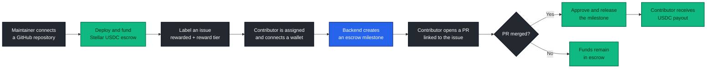

<div align="center">


  <br />


  <p>
    <strong>Automated, on-chain bounties for open-source contributors.</strong>
  </p>

  <p>
    Connect a GitHub repository, fund a Stellar USDC escrow, attach rewards to issues,<br />
    and release contributor payouts when the linked pull request is merged.
  </p>

  <p>
    <a href="https://github.com/ryzen-xp/Trustless-OSS/actions/workflows/ci-frontend.yml">
      
    </a>
    <!-- <a href="https://github.com/ryzen-xp/Trustless-OSS/actions/workflows/pr-checks.yml">
      
    </a> -->
    <a href="LICENSE">
      
    </a>
  </p>

  <p>
    
    
    
    
    
    
  </p>

  <p>
    <a href="#-how-it-works">How it works</a> ·
    <a href="#-software-stack">Software stack</a> ·
    <a href="#-quick-start">Quick start</a> ·
    <a href="docs/BOT_COMMANDS.md">Bot commands</a>
  </p>
</div>

---

## ✨ What is Trustless OSS?

Trustless OSS connects GitHub contribution workflows with programmable escrow payments. Maintainers can reserve rewards for issues while contributors get a clear, verifiable path from assignment to payout.

This repository contains the **standalone web application**. It provides the GitHub-authenticated dashboard, repository setup, Stellar wallet interactions, escrow controls, contributor onboarding, and calls to the separately deployed Trustless OSS backend API.

### Why it exists

- **For maintainers:** replace spreadsheets, manual transfers, and payout coordination with a repeatable bounty workflow.
- **For contributors:** make the reward, milestone, and payout state visible before the work is completed.
- **For communities:** connect code review and pull-request merges to transparent USDC escrow activity.

## 🚀 Core capabilities

| Capability               | What it provides                                                                               |
| ------------------------ | ---------------------------------------------------------------------------------------------- |
| 🔗 GitHub integration    | GitHub OAuth, GitHub App installation, and repository synchronization                          |
| 🏦 Escrow dashboard      | Deploy, fund, inspect, refund, and monitor Trustless Work escrows                              |
| 🏷️ Issue bounties        | Fixed reward tiers and custom USDC rewards driven by GitHub labels                             |
| 👛 Wallet onboarding     | Stellar wallet connection and contributor payout-address registration                          |
| ⚡ Automated releases    | Milestone payout orchestration after a linked pull request is merged                           |
| 🌉 Cross-chain selection | CCTP payout destination UI for supported contributor networks                                  |
| 📡 Activity visibility   | Repository balances, issue state, contributors, and escrow event history                       |
| 🛡️ Project safeguards    | Linting, type checks, production builds, dependency audits, PR validation, and secret scanning |

## 🔄 How it works



For automatic matching, the pull-request body must reference the bounty issue with a closing keyword such as `Closes #123`, `Fixes #123`, or `Resolves #123`.

## 🧰 Software stack

| Layer                       | Software                                                                                                                | Role in the project                                                            |
| --------------------------- | ----------------------------------------------------------------------------------------------------------------------- | ------------------------------------------------------------------------------ |
| Web framework               | [Next.js 16](https://nextjs.org/) + [React 19](https://react.dev/)                                                      | App Router pages, server rendering, route handlers, and interactive UI         |
| Language                    | [TypeScript 5](https://www.typescriptlang.org/)                                                                         | Typed application and integration code                                         |
| Styling                     | [Tailwind CSS 4](https://tailwindcss.com/)                                                                              | Responsive visual system and component styling                                 |
| Authentication and realtime | [Supabase](https://supabase.com/)                                                                                       | GitHub authentication, session handling, and optional escrow event streaming   |
| Source control integration  | [GitHub App](https://docs.github.com/en/apps)                                                                           | Repository installation, issue events, assignments, and pull-request lifecycle |
| Wallet layer                | [Stellar Wallets Kit](https://github.com/Creit-Tech/Stellar-Wallets-Kit) + [Freighter API](https://docs.freighter.app/) | Wallet discovery, connection, and transaction signing                          |
| Blockchain SDK              | [Stellar SDK](https://stellar.github.io/js-stellar-sdk/)                                                                | Stellar transaction and network integration                                    |
| Escrow protocol             | [Trustless Work](https://www.trustlesswork.com/)                                                                        | Multi-release escrow deployment, funding, milestones, release, and refunds     |
| Settlement asset            | [USDC](https://www.circle.com/usdc)                                                                                     | Bounty funding and contributor payouts                                         |
| Cross-chain routing         | [Circle CCTP](https://developers.circle.com/cctp)                                                                       | Contributor payout routing surfaced by the cross-chain destination UI          |
| Testing                     | [Vitest](https://vitest.dev/) + [Testing Library](https://testing-library.com/)                                         | Component and application-logic tests with coverage thresholds                 |
| Code quality                | ESLint + Prettier + TypeScript                                                                                          | Static analysis, formatting, and type safety                                   |
| Package manager             | [pnpm 11](https://pnpm.io/)                                                                                             | Reproducible dependency installation and project scripts                       |
| Deployment                  | [Vercel](https://vercel.com/)                                                                                           | Next.js build and hosting configuration                                        |
| Automation                  | [GitHub Actions](https://github.com/features/actions)                                                                   | CI builds, audits, PR policy checks, and secret scanning                       |

## 🧭 Architecture

```text
GitHub OAuth / GitHub App
           │
           ▼
┌──────────────────────────────┐
│ Trustless OSS Web App        │
│ Next.js · React · TypeScript │
└───────────┬──────────┬───────┘
            │          │
            │          └──────────► Supabase
            │                        Auth + optional realtime events
            ▼
   External backend API
            │
            ├──────────► GitHub event orchestration
            │
            └──────────► Trustless Work escrow on Stellar
                                      │
                                      └──► USDC payout / CCTP route
```

> **Repository boundary:** backend webhook processing, database persistence, and payout orchestration are consumed through `NEXT_PUBLIC_BACKEND_URL`; their implementation is not part of this frontend repository.

## ⚡ Quick start

### Prerequisites

- [Node.js](https://nodejs.org/) **22 or newer**
- [pnpm](https://pnpm.io/installation) **11**
- Supabase project credentials
- A running Trustless OSS backend API
- A GitHub App configured for repository installation

### Installation

```bash
git clone https://github.com/ryzen-xp/Trustless-OSS.git
cd Trustless-OSS

pnpm install --frozen-lockfile
cp .env.example .env.local
pnpm dev
```

Open [http://localhost:3000](http://localhost:3000) in your browser.

### Environment variables

| Variable                        | Required | Purpose                                                  |
| ------------------------------- | :------: | -------------------------------------------------------- |
| `NEXT_PUBLIC_SUPABASE_URL`      |   Yes    | Supabase project URL                                     |
| `NEXT_PUBLIC_SUPABASE_ANON_KEY` |   Yes    | Public Supabase anonymous key                            |
| `NEXT_PUBLIC_BACKEND_URL`       |   Yes    | Base URL of the external Trustless OSS API               |
| `NEXT_PUBLIC_GITHUB_APP_SLUG`   |   Yes    | GitHub App slug used by the repository connection flow   |
| `NEXT_PUBLIC_APP_URL`           |   Yes    | Public web-app URL; use `http://localhost:3000` locally  |
| `NEXT_PUBLIC_EVENT_STREAM`      |    No    | Set to `supabase` to subscribe to realtime escrow events |

Public `NEXT_PUBLIC_*` values are included in the browser bundle. Never place private keys, service-role keys, wallet secrets, or signing credentials in them.

## 🧪 Development commands

| Command              | Purpose                                                 |
| -------------------- | ------------------------------------------------------- |
| `pnpm dev`           | Start the local Next.js development server with Webpack |
| `pnpm build`         | Create a production build                               |
| `pnpm start`         | Serve the production build                              |
| `pnpm test`          | Run the Vitest suite once                               |
| `pnpm test:coverage` | Run focused coverage checks with 90% thresholds         |
| `pnpm lint`          | Run ESLint across `app/` and `lib/`                     |
| `pnpm typecheck`     | Check TypeScript without emitting files                 |
| `pnpm format:check`  | Check TypeScript and TSX formatting                     |

Commands used in GitHub issue comments are documented separately in the [bot command guide](docs/BOT_COMMANDS.md).
